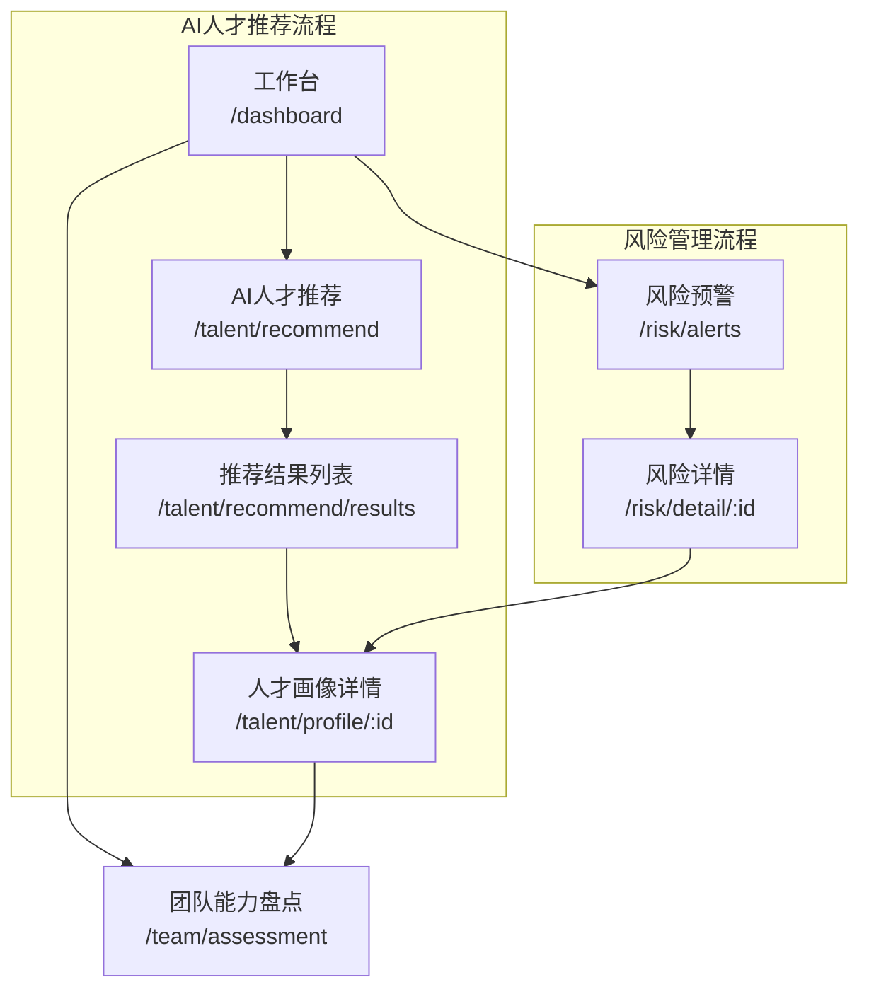

# User Flow — AI人才洞察平台

```mermaid
graph TD
  %% 主要页面（从主导航访问）
  Dashboard["工作台<br/>/dashboard"]
  RiskAlerts["风险预警<br/>/risk/alerts"]

  %% 核心业务功能：AI人才推荐
  subgraph "AI人才推荐流程"
    Dashboard --> TalentRecommend["AI人才推荐<br/>/talent/recommend"]
    TalentRecommend --> RecommendResults["推荐结果列表<br/>/talent/recommend/results"]
    RecommendResults --> TalentProfile["人才画像详情<br/>/talent/profile/:id"]
  end

  %% 风险预警流程
  subgraph "风险管理流程"
    Dashboard --> RiskAlerts
    RiskAlerts --> RiskDetail["风险详情<br/>/risk/detail/:id"]
  end

  %% 团队能力盘点
  Dashboard --> TeamAssessment["团队能力盘点<br/>/team/assessment"]

  %% 跨页面导航
  RiskDetail --> TalentProfile
  TalentProfile --> TeamAssessment
```
